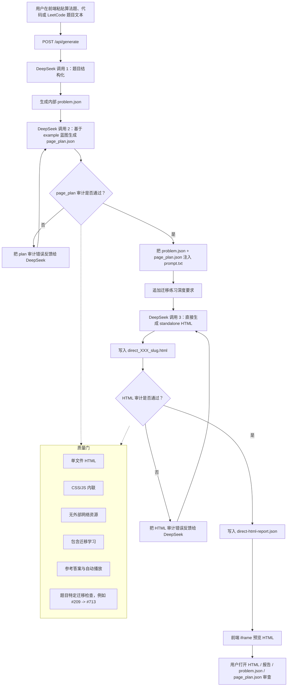

# Direct HTML 算法认知课件生成器

这是一个独立的 direct-html 工作流，只保留一条链路：

```text
用户粘贴算法题、代码分析题或 LeetCode 题目文本
-> LLM 结构化为 problem.json
-> LLM 基于 example 蓝图生成 page_plan.json
-> page_plan 审计通过后，LLM 直接生成 standalone HTML
-> 审计失败则反馈错误并重试
-> 前端预览生成的学习材料
```

它不依赖原项目里的 `LessonSpec`、builder、runtime pack 或 schema compiler。

## 工作流图



## 运行

需要 Python 3.9+。

复制环境变量文件：

```bash
copy .env.example .env
```

在 `.env` 中填入：

```bash
DEEPSEEK_API_KEY=你的 key
```

启动本地前端：

```bash
python -m direct_html_workflow.cli serve
```

打开：

```text
http://127.0.0.1:8765
```

然后粘贴一道算法题、代码分析题或 LeetCode 题目的完整文本，点击“生成学习材料”。

## CLI 用法

从题目文本生成 HTML：

```bash
python -m direct_html_workflow.cli generate samples/leetcode_209.txt --output outputs/leetcode-209
```

只把题目文本结构化为 JSON：

```bash
python -m direct_html_workflow.cli structure samples/leetcode_209.txt --output outputs/problem.json
```

审计一个 direct HTML 文件：

```bash
python -m direct_html_workflow.cli check outputs/leetcode-209/direct_209_minimum-size-subarray-sum.html --problem outputs/leetcode-209/problem.json
```

## 输入

真正的用户输入是一道题的文本，可以是普通算法题、代码分析题或 LeetCode 题。推荐包含：

- 题号
- 题名
- 描述
- 示例
- 约束
- 函数签名或核心代码

题号不是必需项。系统会先调用 DeepSeek 把文本整理为内部 `problem.json`，再把这个 JSON 注入 `prompt.txt`。

如果输入不是 LeetCode 题，`leetcodeId` 会设为 `0`，并按普通算法题生成学习材料。

## 输出

每次生成会写入一个目录：

```text
outputs/YYYYMMDD-HHMMSS/
  problem.json
  page_plan.json
  direct_XXX_slug.html
  direct-html-report.json
```

前端会直接用 iframe 预览 HTML。

## 质量门

当前审计包含：

- 必须是 standalone HTML
- CSS 和 JavaScript 必须内联
- 不允许外部网络资源
- 必须包含原题标题或分析主题
- 必须包含迁移学习
- 必须有参考答案入口
- 必须有 trace 自动播放

对于 LeetCode 209，额外要求迁移到 LeetCode 713，并包含：

- `product`
- `product >= k`
- `right-left+1` 或 `right - left + 1`
- 固定右端点批量计数解释

## 注意

不要把 `.env` 或真实 API key 提交到 GitHub。
